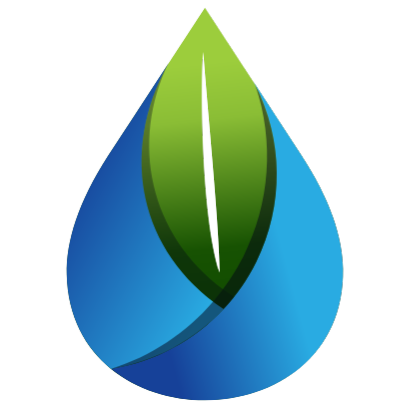

  

<h1 align="center">Experiment Greenwash (Cista Water / DIY Green News)</h1>

  <strong>Sebuah platform eksperimen web interaktif untuk mengukur persepsi dan respons masyarakat terhadap isu *Greenwashing*.</strong>

  <a href="https://experiment-greenwash.vercel.app/" target="_blank">Lihat Website Langsung (Live Demo)</a>

---

## 📖 Tentang Proyek Ini

**Experiment Greenwash** adalah sebuah aplikasi web penelitian/eksperimen berbasis kuesioner interaktif. Proyek ini dibangun dengan tujuan utama untuk:
1. **Mengumpulkan Data Demografi**: Mengumpulkan latar belakang responden (usia, pendidikan, penghasilan, lokasi, dll.) secara efisien.
2. **Memberikan Intervensi (Stimulus)**: Menampilkan berbagai variasi berita (*news-vocal*, *news-partial*, *news-gwash*) yang dilengkapi dengan video presentasi edukatif.
3. **Mengukur Respons (Pre-test & Post-test)**: Melakukan pengujian pemahaman dan pandangan responden sebelum (*pre-test*) dan sesudah (*post-test*) mereka menerima informasi terkait praktik *Greenwashing* di industri.

Aplikasi ini didesain agar mudah diakses, memiliki tampilan antarmuka yang modern, responsif di berbagai perangkat (komputer maupun ponsel), serta terintegrasi langsung dengan database *cloud* agar peneliti dapat langsung menganalisis data yang masuk secara *real-time*.

## 🚀 Teknologi yang Digunakan (Tech Stack)

Proyek ini dibangun menggunakan teknologi modern untuk memastikan kecepatan, keamanan, dan kemudahan dalam pengembangan maupun *deployment*:

### Backend & Infrastruktur
- **[Laravel 11](https://laravel.com/)**: Framework PHP yang kuat dan elegan, digunakan sebagai mesin utama untuk mengelola *routing*, *controller*, arsitektur MVC, dan pengolahan data.
- **[Supabase (PostgreSQL)](https://supabase.com/)**: Layanan database *cloud* modern. Memanfaatkan fitur *Connection Pooling* (Supavisor) agar koneksi ke database tetap stabil dan aman saat diakses oleh banyak responden secara bersamaan.
- **[Vercel](https://vercel.com/)**: Platform *deployment* berbasis *Serverless*. Menggunakan *runtime* `vercel-community/php` untuk mengeksekusi kode PHP secara *on-demand* di arsitektur *Edge*, dipadukan dengan konfigurasi `/tmp` lokal untuk menunjang kebutuhan file sistem Laravel yang *read-only*.

### Frontend & Antarmuka Pengguna (UI)
- **HTML5 & Vanilla CSS**: Struktur dan desain web yang kustom dan spesifik.
- **[Bootstrap 5.3](https://getbootstrap.com/)**: Framework CSS terpopuler untuk memastikan seluruh halaman *form* dan artikel berita tampil responsif (*mobile-friendly*) dengan komponen yang rapi.
- **[SweetAlert2](https://sweetalert2.github.io/)**: Menampilkan notifikasi *pop-up* yang cantik dan interaktif untuk memberikan *feedback* kepada pengguna.
- **[Iconify](https://iconify.design/)**: Penyedia ikon modern tanpa memberatkan kecepatan muat halaman.

## 📂 Struktur Alur Aplikasi

Aplikasi berjalan dengan alur linear yang didesain sedemikian rupa agar responden menyelesaikan eksperimen secara bertahap:
1. **Halaman Mulai (`/`)**: Pengguna disambut dan diminta mengisi data demografi dasar yang terhubung langsung ke tabel `users`.
2. **Pre-test (`/preTest`)**: Penilaian awal terhadap pengetahuan pengguna sebelum intervensi.
3. **Materi Edukasi / Berita**: Pengguna diarahkan secara acak (atau melalui skenario) ke halaman berita tertentu (misal: `/news-gwash`) untuk membaca artikel dan menonton video studi kasus Cista Water.
4. **Post-test (`/postTest`)**: Penilaian akhir untuk membandingkan perubahan persepsi setelah menerima informasi.
5. **Selesai (`/end`)**: Ucapan terima kasih dan penutupan eksperimen.

## 🌐 Live Deployment

Proyek ini telah beroperasi secara penuh dan dapat diakses publik melalui Vercel di tautan berikut:
**[https://experiment-greenwash.vercel.app/](https://experiment-greenwash.vercel.app/)**

*(Semua data yang disubmit melalui tautan tersebut akan langsung tersimpan secara aman di database Supabase).*

---

*Dikembangkan untuk keperluan penelitian akademis dan edukasi mengenai lingkungan.*
